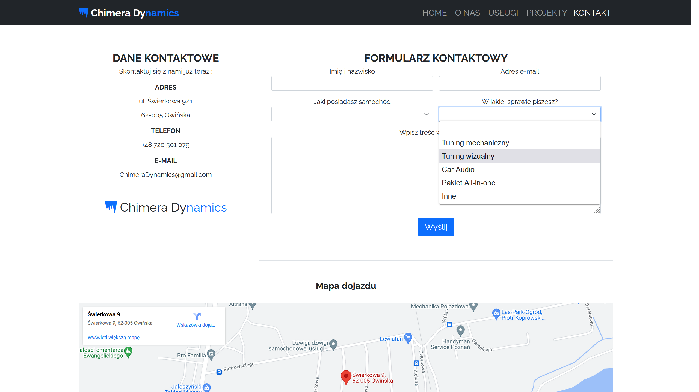

# Chimera Dynamics

## Screenshots

    </img>
     
    </img>
     
    </img>
     
    </img>

## Description

- Website of a (hypothetical) company called Chimera Dynamics that upgrades cars!
- Website contains 4 subpages: AboutUs, Services, Projects, Contact.
- Each subpage contains place for description (because it's hypothetical page, most of the content is filled by **Lorem Ipsum**)
- In the Contact subpage, customers can choose the type of thier car they want to upgrade, and also choose what type of tuning are they looking for.

#### Technology used:
- HTML, CSS, JS
- SCSS
- **Framework:** Bootstrap